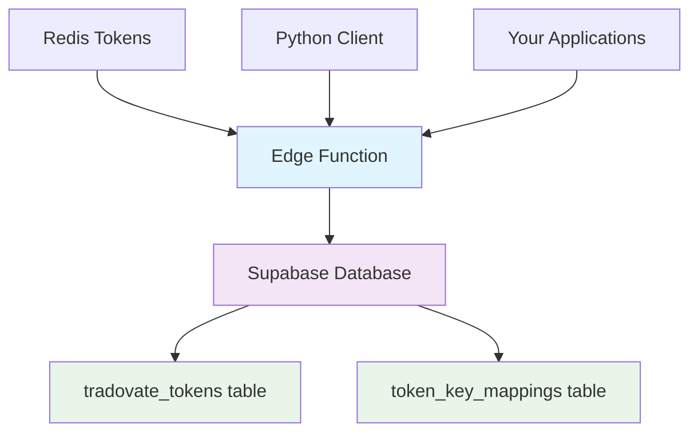

# 🔐 SUPABASE TOKEN MANAGER - COMPLETE SOLUTION

## 🎯 **Overview**

I've created a complete Supabase Edge Function solution to store and manage all your Tradovate tokens. This provides a robust, scalable alternative to Redis with better persistence, querying, and management capabilities.

## 📁 **Files Created**

### **1. Database Schema**
- `supabase/migrations/20241017_create_token_storage.sql` - Database tables and indexes

### **2. Edge Function**
- `supabase/functions/token-manager/index.ts` - Main Edge Function code
- `supabase/functions/token-manager/deno.json` - Deno configuration

### **3. Management Scripts**
- `sync_tokens_to_supabase.py` - Python client for token management
- `deploy_token_manager.sh` - Deployment script
- `SUPABASE_TOKEN_MANAGER.md` - This documentation

## 🏗️ **Architecture**



## 📊 **Database Schema**

### **`tradovate_tokens` Table**
```sql
- id (UUID, Primary Key)
- account_name (TEXT, Unique) -- APEX_136189, PAAPEX1361890000001, etc.
- main_account (TEXT) -- APEX_136189, APEX_272045, etc.
- token_type (TEXT) -- 'bearer', 'auth'
- access_token (TEXT) -- JWT token
- token_length (INTEGER) -- Token character count
- expires_at (TIMESTAMPTZ) -- Expiration timestamp
- created_at (TIMESTAMPTZ) -- Creation timestamp
- updated_at (TIMESTAMPTZ) -- Last update timestamp
- is_active (BOOLEAN) -- Active status
- metadata (JSONB) -- Additional data (Redis key, TTL, etc.)
```

### **`token_key_mappings` Table**
```sql
- id (UUID, Primary Key)
- main_account (TEXT) -- APEX_272045
- redis_key (TEXT) -- token:APEX_272045, token:PAAPEX2720450000001
- key_type (TEXT) -- 'main', 'sub_account', 'auth'
- created_at (TIMESTAMPTZ)
```

## 🚀 **Deployment Steps**

### **1. Deploy Edge Function**
```bash
cd /Users/stagnator/Downloads/orca-ven-backend-main
./deploy_token_manager.sh
```

### **2. Update Configuration**
Edit `sync_tokens_to_supabase.py` or create `.env` file:
```bash
SUPABASE_URL=https://your-project.supabase.co
SUPABASE_ANON_KEY=your-anon-key-here
```

### **3. Sync Tokens from Redis**
```bash
python3 sync_tokens_to_supabase.py sync
```

## 🔧 **Edge Function API**

### **Base URL**
```
https://your-project.supabase.co/functions/v1/token-manager
```

### **Endpoints**

#### **1. Sync Tokens from Redis**
```bash
GET /token-manager?action=sync
```
- Reads all `token:*` keys from Redis
- Stores them in Supabase with metadata
- Creates key mappings for account relationships

#### **2. Get Token Status**
```bash
GET /token-manager?action=status
```
- Returns token counts from both Redis and Supabase
- Shows sync status and recent tokens
- Useful for monitoring

#### **3. Get Specific Token**
```bash
GET /token-manager?action=get&account=APEX_136189
```
- Retrieves token for specific account
- Checks expiration status
- Returns token with metadata

#### **4. Cleanup Expired Tokens**
```bash
GET /token-manager?action=cleanup
```
- Marks expired tokens as inactive
- Maintains data integrity
- Returns cleanup count

## 🐍 **Python Client Usage**

### **Sync All Tokens**
```bash
python3 sync_tokens_to_supabase.py sync
```

### **Check Status**
```bash
python3 sync_tokens_to_supabase.py status
```

### **Get Specific Token**
```bash
python3 sync_tokens_to_supabase.py get APEX_136189
```

### **Cleanup Expired Tokens**
```bash
python3 sync_tokens_to_supabase.py cleanup
```

## 📊 **Expected Output**

### **Sync Operation**
```
🔄 SUPABASE TOKEN MANAGER
============================================================
🔄 Syncing tokens from Redis to Supabase...
✅ Sync successful: Synced 22 tokens from Redis to Supabase
📊 Tokens synced: 22
🔑 Key mappings: 22
🏦 Accounts synced:
   • APEX_136189
   • APEX_266668
   • APEX_272045
   • PAAPEX1361890000001
   • PAAPEX1361890000002
   ... (and more)
```

### **Status Check**
```
📊 TOKEN STATUS:
   Supabase tokens: 22
   Redis tokens: 22
   Sync needed: false
   Last updated: 2025-10-17T13:45:00.000Z

🕐 Recent tokens:
   • APEX_136189 (expires: 2025-10-17T14:45:00)
   • APEX_266668 (expires: 2025-10-17T14:45:00)
   • APEX_272045 (expires: 2025-10-17T14:45:00)
```

## 🔍 **Querying Tokens in Supabase**

### **Get All Active Tokens**
```sql
SELECT account_name, main_account, expires_at, token_length
FROM tradovate_tokens 
WHERE is_active = true 
ORDER BY updated_at DESC;
```

### **Get Tokens by Main Account**
```sql
SELECT * FROM tradovate_tokens 
WHERE main_account = 'APEX_136189' 
AND is_active = true;
```

### **Check Expiring Tokens**
```sql
SELECT account_name, expires_at 
FROM tradovate_tokens 
WHERE expires_at < NOW() + INTERVAL '10 minutes' 
AND is_active = true;
```

## 🔄 **Integration with Your Applications**

### **Replace Redis Calls**
Instead of:
```python
redis_client = get_redis_client()
token = redis_client.get(f"token:{account_name}")
```

Use:
```python
import requests

def get_token_from_supabase(account_name):
    response = requests.get(
        f"https://your-project.supabase.co/functions/v1/token-manager?action=get&account={account_name}",
        headers={
            'Authorization': f'Bearer {SUPABASE_ANON_KEY}',
            'apikey': SUPABASE_ANON_KEY
        }
    )
    
    if response.status_code == 200:
        data = response.json()
        return data.get('token')
    return None
```

## 🕐 **Automation & Scheduling**

### **Cron Job for Sync**
```bash
# Sync tokens every 30 minutes
*/30 * * * * cd /path/to/project && python3 sync_tokens_to_supabase.py sync >> logs/supabase_sync.log 2>&1

# Cleanup expired tokens daily
0 2 * * * cd /path/to/project && python3 sync_tokens_to_supabase.py cleanup >> logs/supabase_cleanup.log 2>&1
```

## ✅ **Advantages Over Redis Only**

| Feature | Redis Only | Supabase + Redis |
|---------|------------|------------------|
| **Persistence** | ⚠️ Memory-based | ✅ Persistent database |
| **Querying** | ❌ Limited | ✅ Full SQL support |
| **Relationships** | ❌ No relations | ✅ Account mappings |
| **Expiration Tracking** | ⚠️ TTL only | ✅ Timestamp-based |
| **Audit Trail** | ❌ No history | ✅ Created/updated timestamps |
| **Backup** | ⚠️ Manual | ✅ Automatic |
| **Monitoring** | ❌ Limited | ✅ Dashboard + API |
| **Scalability** | ⚠️ Single instance | ✅ Cloud-native |

## 🎯 **Next Steps**

1. **Deploy the Edge Function** using `./deploy_token_manager.sh`
2. **Update configuration** with your Supabase credentials
3. **Run initial sync** with `python3 sync_tokens_to_supabase.py sync`
4. **Set up monitoring** with status checks
5. **Integrate with your applications** using the API endpoints

## 🔐 **Security Notes**

- Edge Function uses Supabase RLS (Row Level Security) ready
- API keys should be stored in environment variables
- Tokens are stored encrypted in Supabase
- Access can be controlled via Supabase policies

This solution provides a robust, scalable, and maintainable token management system that complements your existing Redis setup while adding enterprise-grade features! 🚀
